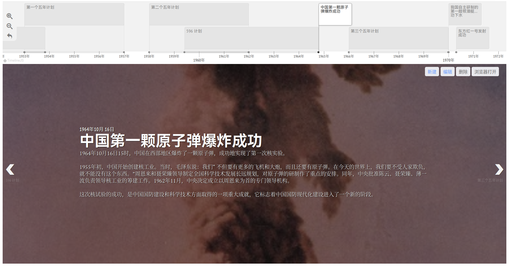

# Timeline Beta

此项目是将 [TimelineJS3](https://github.com/NUKnightLab/TimelineJS3) 移植为思源笔记挂件。

## 预览

## 使用说明

* **界面介绍**

  界面分为上、下两部分，上方为时间轴，时间轴上显示所创建的事件和时期；下方为幻灯片，点击时间轴上的事件或时期即可展示其具体内容。
* **时间线内容组成：** 标题、事件和时期

  * 标题是用来描述该时间线的主题，一个时间线仅有一个标题，不可删除。
  * 事件是对应某一时间点的项目，在时间轴上占据某一时间点。
  * 时期是对应某一时间段的项目，在时间轴上占据某一时间段。
* **时间线编辑操作：** 新建、编辑和删除

  * 新建：点击新建按钮可新建一个项目，其中开始日期和标题为必填项，结束日期、描述和背景图片为选填项。
    若结束日期留空，则表示该项目为一个事件，否则表示一个时期。
    描述为对该时间或时期的具体描述。
    背景图片为该事件或时期对应幻灯片的背景，背景图片须填入图片的 url ，也可为思源的资源文件，格式为 `assets/xxx.jpg/png`。

    
  * 编辑：点击编辑按钮可编辑当前幻灯片所对应的事件或时期的内容。
  * 删除：点击编辑按钮可编辑当前幻灯片所对应的事件或时期，注意当时间轴上仅有一个事件或时期时无法删除，因为时间轴上至少要有一个项目。
* **数据存储：** 时间线数据存储在挂件块的自定义属性中，建议将数据做个备份以防不测。

## 感谢

[NUKnightLab](https://github.com/NUKnightLab) 的 [TimelineJS3](https://github.com/NUKnightLab/TimelineJS3)

感谢**池鱼**以及 [Zuoqiu-Yingyi](https://github.com/Zuoqiu-Yingyi) 提供的帮助
